# JSync - Esame di Laboratorio Sistemi Operativi A.A. 2014-2015
>*Build software better, together.*


## LOBSTER 


Componenti:

- **Gianmarco Spinaci** 0000691241
- **Michele Lorubio**   0000693868
- **Chiara Babina**	  0000693799
- **Valentina Tosto**   0000692741

## Introduzione

<b>JSync-Lobster</b> è un servizio di condivisione di repositories tra Clients.<br>
Grazie ad una semplice ed intuitiva <b>UI</b> in modalità command line (Cli), l'utente può interagire con i Servers registrati, che mantengono le informazioni sulle repositories.<br>
Con pochi comandi l'utente può gestire i diversi Servers e richiedere o creare una repository su di essi, tenendo conto delle varie eccezioni che potrebbero sollevarsi durante l'esecuzione.<br>
L'utilità di tale servizio è data attraverso una pratica gestione del problema readers-writers, permettendo a tutti gli utenti di avere la possibilità di gestire le repositories sui Servers in comune, rispettando la concorrenza.<br>
La <b>UX</b> è agevolata anche grazie all'aggiunta di un comando per visualizzare tutte le funzionalità offerte da JSync.<br>
In seguito spiegheremo nel dettaglio la struttura completa del nostro progetto.


## Consegna

Il progetto deve essere eseguito lanciando i servizi <b>cli.ol</b> ed i <b>server.ol</b> a disposizione.<br>
Successivamente si scrive un comando in input sulla <b>UI</b>, il quale sarà inviato al <b>clientUtilities.ol</b>, e si aspetterà una sua risposta.

### Demo

Questa demo esplicativa è in riferimento alla cartella Demo.zip, contenuta nella root del progetto.
Di seguito la struttura

   Client side   |   Server side
-------------------| -------------
_WebDesign  | 4000_localhost
_Desert0.1     | 5000_localhost


Esistono già 3 Repositories salvate sui Servers

- 4000_localhost
      - Design_Assets
      - List_Desert
- 5000_localhost
     - SerieA_player

Elenco di comandi Demo di JSync-Lobster

1) Lanciare entrambi i Servers e Clients

2) In entrambi i Clients sono presenti già alcuni Servers registrati
```java
list servers    // ritorna la lista dei Servers registrati (contenuti nel file config.xml)
```
3) Dal Client <b>_Desert0.1</b> eseguire il comando
 ```java
addServer 5000_localhost socket://localhost:5000    //aggiunge un ulteriore Server registrato
```
A questo punto il Client <b>_Desert0.1</b> avrà entrambi i Servers registrati.

4) Si possono visualizzare le Repositories registrate localmente con il comando
 ```java
list reg_repos
```
oppure tutte le Repositories disponibili sui Servers registrati tramite il comando
 ```java
list new_repos
```
se uno o più Servers non esistono, o non sono raggiungibili si avrà un responso negativo.

5) Sempre dal Client <b>_Desert0.1</b> eseguire l'operazione Pull della Repository <b>SerieA_Player</b>
 ```java
pull 5000_localhost SerieA_Player
```

6) <b>_Desert0.1</b> a questo punto può modificare la Repository ed effetture una Push
```java
push 5000_localhost SerieA_Player
```

7) In seguito dal Client <b>_WebDesign</b> si può eseguire, a sua volta, una Pull di <b>SerieA_Player</b>
```java
pull 5000_localhost SerieA_Player
```
e notificare che la versione è stata effettivamente incrementata, con l'aggiunta degli ulteriori files modificati.

8) Prove sulla gestione della concorrenza possono essere eseguite semplicemente con il comando 
```java
push 5000_localhost SerieA_Player
```
in entrambi i Clients, contemporaneamente.

9) Ulteriormente si possono eseguire comandi di eliminazione di un Server e di una Repository
```java
removeServer 4000_localhost

delete 5000_localhost SerieA_Player
```


## Implementazione

### Struttura del Progetto

####Client

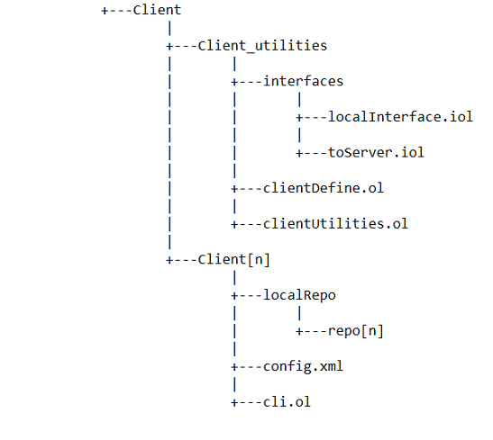

La struttura del Client è composta da:

* Una cartella <b>client_utilities</b> che contiene:
	* La cartella <b>interfaces</b> con al proprio interno l'interfaccia locale tra la Cli ed il clientUtilities 			  (<u>localInterface.iol</u>) e l'interfaccia con il Server (<u>toServer.iol</u>)
	* Il servizio <b>clientDefine.ol</b> contenente i vari define richiamati in <u>clientUtilities.ol</u>
	* Il servizio <b>clientUtilities.ol</b>, il quale ha la funzione di intermediario tra il Client ed il Server, con le 
	  operazioni relative ai comandi ricevuti dalla Cli
	
* Una (o più) cartelle <b>Client[n]</b> con all'interno:
	* Il servizio <b>cli.ol</b>, che ha la funzione di UI, dove si inseriscono i diversi comandi possibili
	* La cartella <b>localRepo</b> (non presente inizialmente), contenente tutte le repositories aggiunte
	* Il file <b>config.xml</b>, con la lista dei Servers registrati in ogni Client

####Server

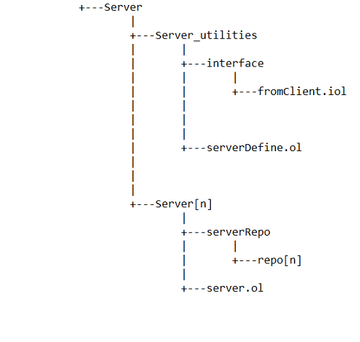

La struttura del Server è composta da:
* Una cartella <b>server_utilities</b> che contiene:
	* La cartella <b>interface</b> con all'interno l'interfaccia tra il clientUtilities ed il Server 				  (<u>fromClient.iol</u>)
	* Il servizio <b>serverDefine.ol</b> contenente i vari define richiamati in <u>server.ol</u>
	
* Uno (o più) cartelle <b>Server[n]</b> con all'interno:
	* Il servizio <b>server.ol</b>, con le operazioni relative ai diversi comandi provenienti dal 				  <u>clientUtilities.ol</u>
	* La cartella <b>serverRepo</b> (non presente inizialmente), contenente tutte le repositories aggiunte

___

Il progetto è diviso in <b>più Cli</b> (che corrispondono ai diversi Client) e <b>Servers</b>, mentre il servizio <b>"clientUtilities.ol"</b> ha la funzione di gestire i diversi comandi tra i Clients e i Servers. <br>
La Cli è collegata con il clientUtilities attraverso una pratica di embedding, per permettere la comunicazione senza aver bisogno di un indirizzo.<br>
Inoltre sono utilizzati dei servizi chiamati <b>"clientDefine.ol"</b> (dalla parte del Client) e <b>"serverDefine.ol"</b> (dalla parte del Server) per gestire diversi metodi, tra i quali la lettura e la scrittura del file xml, il registro dei Servers, la visita ricorsiva di una repository, la creazione di cartelle e l'operazione modulo per l'incremento dei readers / writers. <br>
In particolare, dopo aver inserito un comando in console, è splittato nella Cli, per analizzare ogni singola stringa e differenziare le varie funzionalità; successivamente si invia il comando nel clientUtilities, eseguendo l'operazione relativa.<br>
Di seguito elenchiamo i comandi, descrivendoli nello specifico:

* <b>NB</b>: Ogni funzionalità è inclusa in uno scope per gestire le eccezioni che si presentano, tra le quali l’inserimento di dati non corretti, la connessione assente con il Server ed un file non trovato.
* <b>NB (2)</b>: L'esecuzione del procedimento è eseguito solo se i risultati splittati nella Cli corrispondono alla lunghezza richiesta del comando (es: list(1) servers(2) -> il risultato dello split deve essere di dimensione 2).

### List Servers

Inizialmente si controlla che i dati siano inseriti correttamente, in seguito si procede alla lettura del file xml (richiamato dal servizio <b>clientDefine</b>): se la lista dei Servers non è vuota, per ognuno di essi si stampano le relative informazioni (nome ed indirizzo), altrimenti sarà visualizzato un messaggio di avviso che non sono presenti Servers registrati.

### List reg_repos

Finalizzato alla lettura delle repositories locali, all' inizio si pone come repository principale, che contiene le cartelle create, il nome “localRepo”, e si ricerca ogni repository contenuta richiamando l’operazione <u>list</u> del servizio <b>"file.iol"</b> ed infine si stampano tutte, se sono presenti, altrimenti sarà visualizzato un messaggio di avviso.

### Add Server

Quando si aggiunge un Server si richiama il metodo per la lettura del file xml e si effettua prima un controllo se il nome o indirizzo del Server esiste già (confrontando il nome o l'indirizzo scritto in input con quelli presenti sulla lista), in tal caso viene stampato un messaggio, altrimenti inseriamo il nome ed indirizzo del Server desiderato nel file xml, richiamando il metodo <u>writeFile</u>, presente sempre nel servizio <b>clientDefine</b>.

### Remove Server

Dopo la consueta lettura del file xml, si inserisce un ulteriore costrutto <u>scope</u>, che in caso di Server trovato (e rimosso) solleva l’eccezione di operazione avvenuta con successo.<br> Se il nome inserito in input corrisponde ad uno dei nomi registrati sulla lista, allora si elimina (con il comando <u>undef</u>) e si richiama la scrittura del file xml per apportare le modifiche effettuate.

### Add Repository

Comando per il quale è necessario l’intervento del Server, perchè serve per aggiungere una repository sia sul Client che sul Server.

<b>Client</b>: 

1. Riceve dalla Cli il nome del Server a cui si deve connettere, e si effettua il <u>binding</u>, attraverso il richiamo    del metodo registro (nel servizio <b>clientDefine</b>), scorrendo la lista dei Servers per individuare l’indirizzo del Server a cui collegarsi ed aggiungerlo alla porta di comunicazione.

2. Con l’operazione <u>addRepository</u> si controlla sul Server se il nome della repository da inserire è già esistente, in questo caso ritorna un errore. Se non sono presenti errori allora prosegue analizzando il percorso della directory locale inserito in input, per aggiungerlo al Client e spedirlo al Server.

3. Si richiama la visita delle cartelle (nel servizio <b>clientDefine</b>) e per ogni file trovato si legge il suo percorso          assoluto (<u>readFile</u>) per ottenere così il contenuto del file; in seguito si invia al Server il suo percorso    relativo, provvedendo ad inserirlo nella repository appena creata.

4. Successivamente si richiama il metodo writeFilePath (nel servizio <b>clientDefine</b>) per creare tutte le cartelle del percorso relativo del file, nel caso in cui non esistessero. 

5. Infine nella repository appena creata, si inserisce un file di versione, incrementato ogni volta che si esegue una push.

<b>Server</b>:

1. Riceve dal Client il nome della repository da ricercare, se già esiste allora ritorna un messaggio di errore, altrimenti si crea e si aggiunge il file di versione con contenuto uguale a 0.

2. Con un' ulteriore operazione riceve il percorso relativo di ogni singolo file, ricavato dal Client           attraverso la visita della directory locale, che viene splittato, per creare la cartella a cui appartiene il file, ed     infine scritto nella repository richiesta, con il comando <u>writeFile</u>.


### List new_repos

Comando per far stampare tutte le repositories dei Servers registrati.

<b>Client</b>:
	
1. Se la lista dei Servers nel file xml non è vuota si collega ad ognuno di essi, e cattura             un'eccezione nel caso in cui uno o più Servers non siano in ascolto nella location selezionata (Server non         raggiungibile).

2. Invia la richiesta delle repositories disponibili sui Servers accesi, per stamparne l’elenco. 

<b>Server</b>:

1. Riceve la richiesta dal Client di inviare tutti i nomi delle repositories presenti nella directory               “serverRepo”. Richiama il metodo <u>listFile</u> di <b>file.iol</b> per ottenere l’elenco, se sono disponibili repositories, ed inviarlo al Client, altrimenti sarà stampato un messaggio di avviso relativo al Server con nessuna repository.


### Delete

Comando per eliminare una repository sia sul Server che sul Client.

<b>Client</b>:

1. Si legge il file xml e si richiama il metodo registro (nel servizio <b>clientDefine</b>), per ricavare l'indirizzo necessario a comunicare con il Server richiesto.

2. Si invia la richiesta di eliminazione della repository al Server ed in caso di cancellazione avvenuta (oppure se la       repository già era stata cancellata in precedenza), si esegue la stessa operazione nel Client, con il comando          <u>deleteDir</u> di <b>"file.iol"</b>, eliminando l’intera cartella richiesta in input.

<b>Server</b>:

1. Riceve il messaggio dal Client con il nome della repository da eliminare, scorre la lista di tutte le repositories presenti in          “serverRepo” e se il nome corrisponde a quello ricevuto, elimina la cartella e ritorna il messaggio di             operazione effettuata.

### Push

Comando per inviare l'aggiornamento di una repository del Client sul Server, controllando i files di versione di entrambi.

<b>Client</b>:

1. Si legge il file xml e si richiama il metodo registro (nel servizio <b>clientDefine</b>), per prelevare l'indirizzo del Server nel quale          inviare la push.

2. Si invia la richiesta di incremento della variabile globale dei writers.

3. Se la variabile è stata incrementata, si procede alla spedizione del file di versione, per controllare se è        maggiore o uguale di quello sul Server (solo in tal caso si può eseguire la push) oppure se esiste la repository da inviare (altrimenti deve essere creata).

4. Si esegue la lettura di tutti gli altri files (ignorando quello di versione), si modifica la       repository globale da "localRepo" a "serverRepo" e si inviano uno alla volta sul Server, sovrascrivendoli
   su quelli già presenti o creandoli se non esistono.

5. Il file di versione è gestito attraverso una richiesta al Server, che gli invierà la sua versione da sovrascrivere a  
   quella locale, dopo che già era stata incrementata.

6. Infine si invia la richiesta di decremento della variabile globale dei writers, a operazione conclusa.

<b>Server</b>:

1. Riceve la richiesta di incremento della variabile globale dei writers (all'interno di un costrutto <u>synchronized</u> per        renderla atomica) sono nel caso in cui il numero dei readers sia uguale a 0, altrimenti la push non può essere     eseguita. 

2. Se la variabile dei writers è stata incrementata, riceve il file di versione dal Client e controlla inizialmente se esiste già la repository richiesta, con all'interno il file di versione: se esiste allora confronta le due versioni, solo se quella del Client  è maggiore o uguale di quella del Server allora si incrementa (all'interno di un costrutto <u>synchronized</u> per renderla    atomica); altrimenti se la repository non esiste, si crea e si inserisce all'interno il file di versione, inviato dal Client

3. Riceve uno alla volta i files dal Client, per sovrascriverli ai suoi o crearli se non sono presenti.

4. Riceve la richiesta dal Client di inviargli il file di versione incrementato.

5. Infine decrementa la variabile globale dei writers, inclusa in un costrutto <u>synchronized</u>.

### Pull

Comando per scaricare una repository specifica dal Server e sovrascriverla alla propria locale oppure crearla se non è presente.

<b>Client</b>:

1. Si legge il file xml e si richiama il metodo registro (nel servizio <b>clientDefine</b>), per prelevare l'indirizzo del Server richiesto.

2. Si invia la richiesta di incremento della variabile globale dei readers.

3. Se la variabile dei readers è stata incrementata, si invia il nome della repository desiderata al Server
   e si aspetta la struttura di tutte le cartelle e sottocartelle.

4. Dopo che si ha a disposizione la struttura, si richiedono i files, uno alla volta, al Server, che provvederà ad inviarli.

5. Quando arriva un file, si sostituisce il nome della repository globale da "serverRepo" a "localRepo" e si creano le 
   cartelle per i files che ne necessitano, in caso non esistano.

6. Infine si invia la richiesta di decremento della variabile globale dei readers, a operazione conclusa.

<b>Server</b>:

1. Riceve la richiesta di incremento della variabile globale dei readers (all'interno di un costrutto <u>synchronized</u> per        renderla atomica) sono nel caso in cui il numero dei writers sia uguale a 0, altrimenti la pull non può essere     eseguita.

2. Se la variabile dei readers è stata incrementata, riceve il nome della repository da inviare; se esiste ritorna    un messaggio di successo insieme alla struttura delle cartelle contenute nella propria repository.

3. Riceve una alla volta la richiesta di un file da inviare, contenuto nella repository in questione, e lo spedisce    al Client.

4. Infine decrementa la variabile globale dei readers, inclusa in un costrutto <u>synchronized</u>.


## Gestione del problema reader-writer

Per la gestione della concorrenza tra readers e writers abbiamo avuto diverse alternative valide: l’uso dei semafori nella libreria di Jolie; la gestione dei controlli tramite il file di versione; l’utilizzo di una coda o un merging dei files (GitHub style).<br>
Alla fine abbiamo optato per due implementazioni diverse:

* <b>Push-push</b><br>
Due (o più) writers sono gestiti attraverso il <u>controllo di versione</u>, se il Client1 prova ad effettuare una push mentre il Client2 sta già eseguendo la sua sulla stessa repository, allora il Client1 dovrà prima aggiornare la sua versione, con una pull, e solo successivamente può caricare i suoi files. <br>
Poichè la scrittura del file di versione è una sezione critica, abbiamo deciso di utilizzare un costrutto <u>synchronized</u> per racchiudere questa parte, in modo tale che l'istruzione sia eseguita in maniera atomica. <br>
(Siamo consapevoli che questa scelta porta ad una perdita di dati da parte del Client1 - problema trattato nel dettaglio nella sezione dei "Problemi riscontrati").<br>
E' da tenere presente che due push di due repositories diverse sono permesse, perché una non interferisce con l’altra.<br>

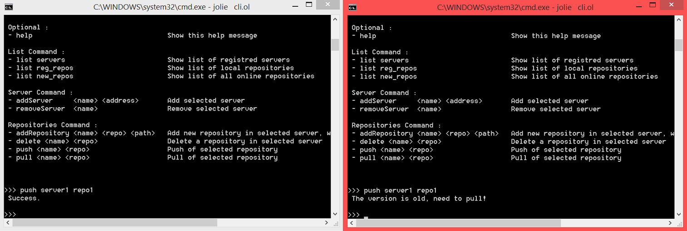

* <b> Push-pull / pull-push</b><br>
Per gestire il problema writer-reader e viceversa, abbiamo utilizzato dei <u>contatori</u> (reader e writer) globali e atomici nel Server, che saranno condivisi da tutti i Clients. <br>
Nello specifico si possono presentare due casi:

	* Il Client1 esegue una **push**: il writerCount sarà incrementato e se contemporaneamente il Client2 esegue una pull, controlla se il writerCount è uguale a 1, in questo caso sarà bloccato con un messaggio di avviso e solo in seguito, quando la push sarà completata, potrà richiamare la pull.

	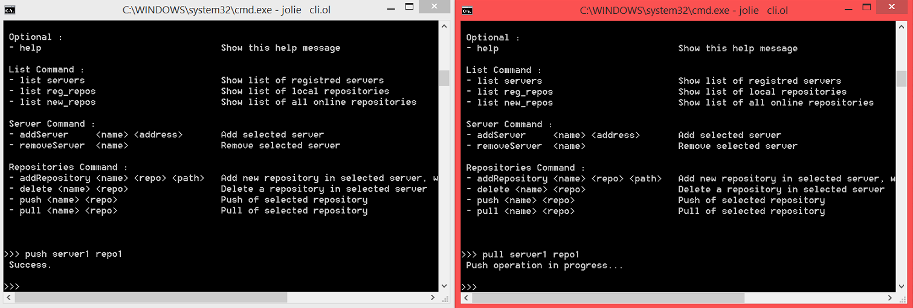

	* Il Client1 esegue una **pull**: il readerCount sarà incrementato e se il Client2 esegue una push dovrà controllare se il readerCount è maggiore o uguale a 1, nel caso i readers siano più di uno, il Client2 dovrà aspettare a tempo indeterminato (problema di starvation). Solo quando il readerCount è uguale a 0, il Client2 potrà effettuare la push.

	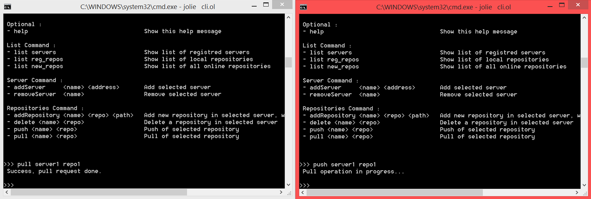

* <b> Pull-pull</b><br>
Due (o più) readers invece sono permessi, quindi non abbiamo inserito <u>nessun controllo</u>, perchè tutti possono scaricare contemporaneamente il contenuto della stessa repository.


## Define utilizzati

Nei servizi <b>clientDefine.ol</b> e <b>serverDefine.ol</b> abbiamo incluso dei define, richiamati frequentemente nei diversi comandi:

####Registro - clientDefine
Utilizzato per settare la location (indirizzo) ad un Server richiesto.

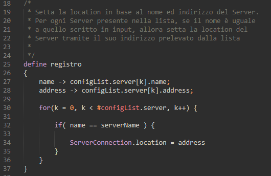

####Lettura / scrittura del file xml - clientDefine
Per la lettura e scrittura del file xml, che contiene la lista dei Servers registrati dai diversi utenti.

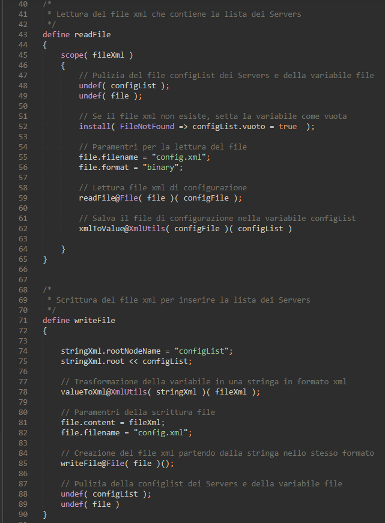

####Creazione di cartelle - clientDefine
Per la creazione di cartelle nell' AddRepository e nella Pull.

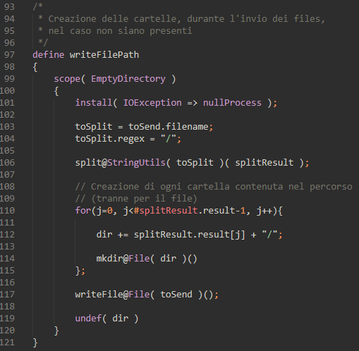

####Visita delle cartelle - clientDefine & serverDefine
Per la visita ricorsiva delle cartelle.<br> La visita funziona quanto segue: partendo da un percorso assoluto, si utilizza il comando <u>list</u> dell'interfaccia <b>string_utils.iol</b> per ottenere tutte le sottocartelle e i files in esso contenuti.<br> Con un ciclo for si salvano le sottocartelle e i files in una variabile diversa e per ognuno si applica nuovamente il comando <u>list</u>: se ciò che ritorna è un elemento vuoto, allora significa che si sta esaminando un file o una cartella vuota.<br> Nel caso in cui il nome contenga un ".", il percorso viene salvato in una variabile finale perchè si tratta di un file; in caso contrario il percorso non viene salvato. <br>Poichè la struttura che memorizza i percorsi assoluti delle cartelle, memorizza anche un attributo booleano mark, che indica se la cartella è già stata visitata o meno, con un ciclo while si cerca la prima cartella con tale attributo settato a false.<br> Dopo ciò, si preparano le variabili per iniziare nuovamente la visita, e si richiama il define.

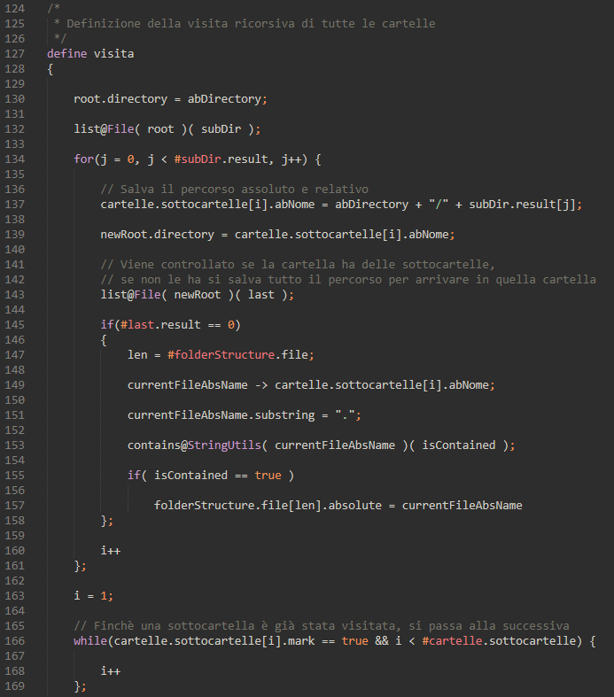
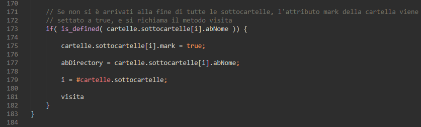

####Inizializzazione delle cartelle - clientDefine & serverDefine
Per inizializzare la visita delle cartelle, e per ottenere i percorsi relativi.<br> Il percorso assoluto iniziale viene diviso e in una variabile viene salvato l'ultimo elemento ottenuto dall'operazione <u>split</u>, che corrisponde all'inizio del percorso relativo.<br> Si richiama la visita, e la variabile ottenuta viene divisa nuovamente: quando si trova un valore uguale alla variabile che ha memorizzato il percorso relativo, allora tutti i successivi valori, che erano stati divisi, vengono salvati per formare il percorso relativo.

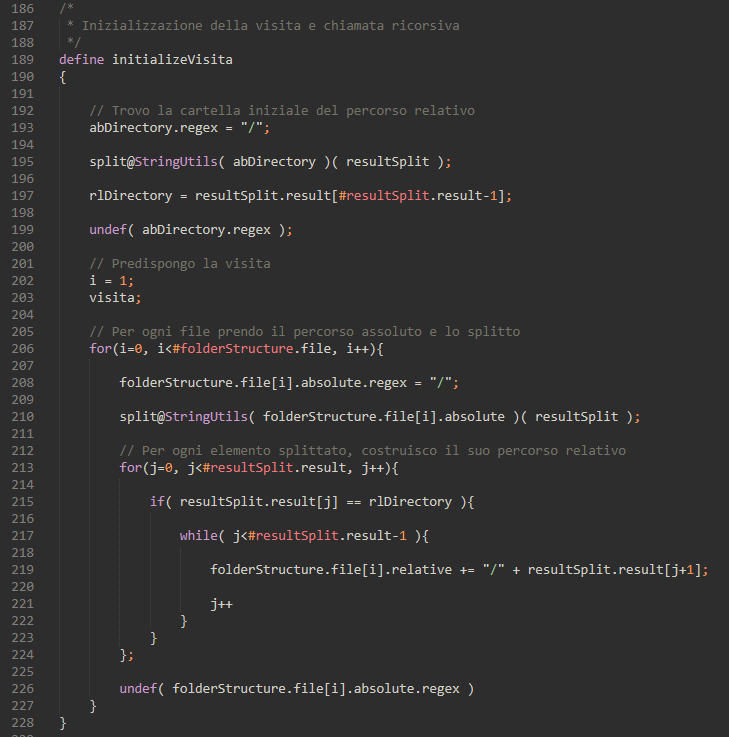

####Modulo - serverDefine
Utilizzato per individuare il corretto indice della variabile globale che corrisponde ai readers/writers.<br> Poichè si dispone di due indici, 0 e 1, l'operazione modulo viene effettuata solo nel caso in cui, in una formula a mod b, a sia maggiore di b, quindi solo quando l'indice corrisponde a 1; nel caso in cui l'indice sia minore, questo viene solo incrementato di 1. Di conseguenza, a seconda dell'indice passato si ottiene quello opposto.<br> E' stato usato in questo modo per poter generalizzare il più possibile la Request-Response per l'incremento della variabile globale dei readers/writers.

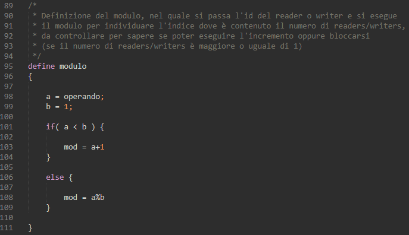

## Problemi riscontrati & soluzioni adottate

### File manager

Inizialmente, per non appesantire il Client e per sfruttare nel migliore dei modi i servizi di Jolie, volevamo implementare un servizio a parte chiamato <b>fileManager.ol</b>.<br> Questo servizio, collegato al <b>clientUtilities.ol</b> attraverso la pratica dell’embedding, serviva per gestire la lettura e scrittura del file xml e per la visita ricorsiva delle cartelle.<br> Alla fine però non è stato possibile mettere in atto questa idea perchè abbiamo riscontrato dei problemi. Lavorando su sistemi operativi diversi abbiamo notato che su macchina Linux si incorreva in errori riguardanti i threads e il programma si arrestava. Invece su macchina Windows sembrava non esserci alcun errore, abbiamo provato a fare le prove da lei consigliate, disinstallare OpenJDK e installare la versione ufficiale di Java, cioè quella di Oracle, ma il problema non si è risolto.<br> Non riuscendo a capire il perchè su macchina Linux il programma generasse questi errori, abbiamo cercato di capire se su macchina Windows andasse veramente tutto bene. Dopo tante prove abbiamo riscontrato il problema anche su di esso, notando che l'utilizzo della CPU era notevole; infatti appena lanciato il programma, l'utilizzo della CPU arrivava al 100%, dopo qualche secondo il consumo si abbassava, per ritornare in pochi secondi al 100%.<br> Allora a quel punto abbiamo deciso di creare il servizio <b>clientDefine.ol</b>, contenente tutti i define richiamati nei comandi del servizio <b>clientUtilities.ol</b>, con la sola differenza di implementarlo senza embedding. In tal modo il programma gira perfettamente su entrambi i sistemi operativi, con un ridotto utilizzo della Cpu.


### Add Repository / Pull (gestione delle cartelle)

Abbiamo avuto dei problemi riguardo i percorsi delle cartelle, poichè non sapevamo come far visitare tutte le sottocartelle della cartella principale e non solo i files contenuti all’interno.<br> In seguito abbiamo deciso di implementare una visita ricorsiva di tutte le sottocartelle, gestendo anche la differenza tra la lettura del file, che accetta un percorso assoluto, e la scrittura, che accetta un percorso relativo.<br> Inoltre nell'Add repository, se sono presenti cartelle vuote nella directory locale che si desidera aggiungere nel Client e nel Server, abbiamo deciso di non farle aggiungere, mentre nella Pull ritorna un messaggio di repository vuota, se nel Server è stato cancellato il contenuto della repository in questione.

### Invio di immagini

Nella nostra soluzione non è possibile spedire immagini, ma solo files prettamente testuali.<br> Per quella funzionalità, basterebbe aggiungere una conversione in binario del contenuto del file.

### Push della stessa Repository

Durante le scelte d' implementazione della push, abbiamo riscontrato il problema della perdita di dati da parte di un Client. Per esempio se avvengono 2 push della stessa repository, ad avere una perdita di dati sarà il Client con la versione più vecchia, cioè quello che arriva successivamente.<br> Abbiamo pensato che comunque il Client in questione sarà notificato con un messaggio di aggiornare la versione prima di procedere con la push, quindi prima di effettuare la pull potrà salvare i dati su cui stava lavorando senza perdere nulla.<br> La procedura più ragionevole sarebbe stata sicuramente quella del merging dei files, però ciò non era richiesto nelle specifiche del progetto quindi abbiamo optato per tralasciare questa idea.

### .DS_Store su MAC

Visto che abbiamo lavorato solo su macchine Windows e Linux, abbiamo voluto provare il progetto anche su un Mac.<br> Eseguendo le varie prove abbiamo notato un errore mai comparso nè su Windows nè su Linux.<br> Quando si apre una cartella manualmente, come "localRepo", si genera automaticamente un file nascosto chiamato ".DS_Store".<br> E se in seguito si richiama un comando, ad esempio <u>list reg_repos</u>, oltre a stampare le repositories salvate localmente, stamperà anche questo file nascosto.

