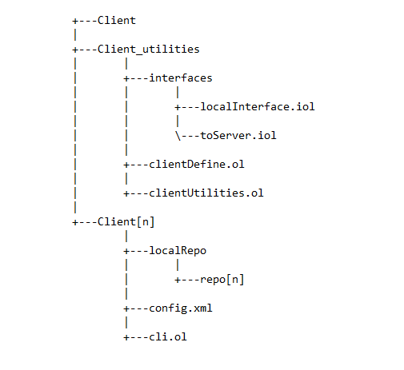

# JSync - Esame di Laboratorio Sistemi Operativi A.A. 2014-2015
>*Build software better, together.*

## LOBSTER

Componenti:

- **Gianmarco Spinaci** 0000691241
- **Michele Lorubio**   0000693868
- **Chiara Babina**	  0000693799
- **Valentina Tosto**   0000692741

## Introduzione

<b>JSync-Lobster</b> è un servizio di condivisione di repositories tra Clients. 
Grazie ad una semplice ed intuitiva <b>UI</b> in modalità command line (Cli), l'utente può interagire con i Servers registrati, che mantengono le informazioni sulle repositories. 
Con pochi comandi l'utente può gestire i diversi Servers e richiedere o creare una repository su di essi, tenendo conto delle varie eccezioni che potrebbero sollevarsi durante l'esecuzione. 
L'utilità di tale servizio è data attraverso una pratica gestione dei readers-writers, permettendo a tutti gli utenti di avere la possibilità di gestire le repositories sul Server in comune, rispettando la concorrenza. 
La <b>UX</b> è agevolata anche grazie all'aggiunta di un comando per visualizzare tutte le funzionalità offerte da JSync. 
In seguito spiegheremo nel dettaglio la struttura completa del nostro progetto.

## Consegna

Il progetto deve essere eseguito lanciando la/le cli ed i server a disposizione. 
Successivamente si scrive un comando in input sulla <b>UI</b>, il quale sarà inviato al Client, e si aspetterà una sua risposta.

### Demo

Le istruzioni per eseguire una demo di esecuzione, con almeno due Clients ed un Server, sono:

1) Lanciare il servizio “server.ol” nella cartella Server1 (o di altri Servers).

2) Avviare i Clients, entrando nella cartella Client1 (facendo partire il servizio “cli.ol”) e seguire la stessa procedura per gli altri Clients.

3) Da una delle due cli eseguire il comando “addServer” indicando il nome del server e l’indirizzo, ad esempio:
 
“addServer server1 socket://localhost:4000”

In questo modo nel file config.xml saranno aggiunte le informazioni del Server.

4) In seguito si può eseguire il comando “list servers”, per visualizzare il Server appena registrato.

5) Aggiungere una repository nuova da un percorso presente sul computer, inserendo il nome del Server, della repo da creare sia nel Client che nel Server e del percorso locale, come in questo esempio:

“addRepository server1 repo1 C:/Users/Prova1”
        
(naturalmente questo è un percorso preso da Windows)
Oltre alla repo con tutti i files, ne sarà creato anche uno di versione sia nella repo locale che in quella online.

6) Per visualizzare la lista delle repositories locali si inserisce il comando “list reg_repos”, mentre per quelle sul Server
“list new_repos”

7) Intanto il secondo Client aggiunge il Server alla lista e in seguito esegue una pull per scaricare la repository presente sul Server, che era stata caricata in precedenza ed attendere circa 10 secondi, prima che l’operazione sia completata.
Ad esempio si scrive il comando: 

			“pull server1 repo1”

8) Il secondo Client può aggiungere un nuovo file alla repo1
(manualmente), così da poter eseguire una push ed aggiornare il Server e la relativa versione, un esempio del comando da scrivere è:

				“push server1 repo1”

9) Il primo Client aggiunge un nuovo file alla repo1, ma se prova ad eseguire una push, un messaggio negherà l’operazione, perché è necessario aggiornare la propria versione e fare la pull.

10) Quindi il primo Client aggiorna la propria repo, facendo una
pull, e successivamente può ri-aggiungere il nuovo file e fare    
la push.

11) Si può testare la concorrenza fra i due Clients, provando a far 
eseguire una pull dal Client1 e contemporaneamente (nell’arco    
dei 10 secondi di tempo) una push dal Client2, che sarà 
bloccata.

12) Infine per cancellare la repo1 sia dal Server che dal Client1,   
si esegue il comando: 

				“delete server1 repo1”

In questo modo la repository non sarà più presente né sul Server né sul Client1, però è ancora disponibile sul Client2.

13) Dopo aver eseguito tutti i comandi, si può cancellare il Server   
con il comando “removeServer” seguito dal nome del Server da   
eliminare.
        

## Implementazione

### Struttura del Progetto

####Client

Format: 

Il progetto è diviso in più Cli, Servers ed un Client che fa da tramite. 
Il Client è collegato alla Cli attraverso l'embedding, così da essere connessi localmente, senza aver bisogno di un indirizzo. Per gestire la trasmissione dei messaggi fra di essi, ad ogni comando è associato un servizio diverso, che può essere eseguito localmente o attraverso una porta collegata ad un Server. 
Inoltre utilizziamo un servizio che includiamo nel Client per gestire diversi metodi, come la lettura e scrittura del file xml, ma anche la visita e creazione di cartelle, che ritroviamo anche in un servizio incluso nel Server.
Il comando viene prima splittato nella Cli, così da essere inviata ogni stringa inserita ed analizzarla singolarmente.
Di seguito elenchiamo i comandi, descrivendoli nello specifico e tenendo presente che in ogni comando abbiamo inserito uno scope per gestire diverse eccezioni che si presentano, tra le quali l’inserimento di dati non corretti, la connessione assente con il Server ed un file non trovato.
Inoltre il procedimento è eseguito se i risultati splittati nella Cli corrispondono alla lunghezza richiesta del comando (es: list(1) servers(2) -> il risultato dello split deve essere di dimensione 2).

### LIST SERVERS

Una volta controllato che i dati inseriti in input siano giusti, procediamo con la lettura del file xml (richiamato dal servizio “utilities.ol”) e se sono presenti Servers nella lista, per ognuno di essi vengono stampate le relative informazioni (nome ed indirizzo), altrimenti un messaggio di avviso che non sono presenti Servers registrati.

### LIST REG_REPOS

In questo comando per la lettura delle repositories locali, inizialmente poniamo come directory “localRepo”, che è il nome della cartella che abbiamo creato in ogni Cli con tutte le varie repo, poi cerchiamo ogni repository richiamando l’operazione List del servizio file.iol ed infine le stampiamo tutte, se sono presenti, altrimenti sarà visualizzato un messaggio di avviso.

### ADD SERVER

Quando si aggiunge un server si richiama il metodo per la lettura del file xml e si effettua prima un controllo se il nome del Server esiste già (confrontando il nome scritto in input con quelli nella lista), in tal caso viene stampato un messaggio, altrimenti inseriamo il nome ed indirizzo del Server desiderato nel file xml, richiamando il metodo writeFile, presente sempre nel servizio “utilities.ol”.

### REMOVE SERVER

Dopo la consueta lettura del file xml, inseriamo un ulteriore scope, che in caso di Server trovato (e rimosso) solleva l’eccezione di operazione avvenuta con successo. Se il nome inserito in input corrisponde ad uno di quelli registrati nella lista, allora si elimina (con il comando undef)e si richiama la scrittura del file xml per apportare le modifiche effettuate. 

### ADD REPOSITORY

Questo è il primo comando che ha bisogno dell’intervento del Server.

Client: 

1) Riceve dalla Cli il nome del Server a cui si deve connettere, e 
   si effettua il Binding, attraverso il richiamo del metodo 
   registro (in “utilities.ol”), scorrendo la lista dei Servers per 
   individuare l’indirizzo del Server a cui collegarsi ed 
   aggiungerlo alla porta di comunicazione.

2) Poi con l’operazione AddRepository si connette con il Server per 
   effettuare un controllo e se il messaggio che gli ritorna è
   positivo, allora prosegue analizzando il percorso della 
   directory locale inserito in input, per aggiungerlo sia nel 
   Client che nel Server.

3) Richiamiamo la visita delle cartelle (in “utilities.ol”) e per 
   ogni file trovato si legge il suo percorso assoluto (readFile)    
   per ottenere così il contenuto del file, in seguito viene 
   inviato al Server il suo percorso relativo, provvedendo ad   
   inserirlo nella repository appena creata.

4) Successivamente richiamiamo il metodo writeFilePath (in  
   “utilities.ol”) per creare la cartella “localRepo” ed inserire 
   tutti i file della directory locale nella repository   
         specificata in input.

5) Infine nella repository appena creata, si inserisce un file .txt  
   di versione, che sarà incrementato ogni volta che si esegue una 
   push.

Server:

1) Riceve dal Client il nome della repository da cercare nella   
   propria cartella, se esiste allora ritorna un messaggio di 
   errore, altrimenti crea la cartella “serverRepo”, se non è già 
   presente, che contiene tutte le cartelle del Server, e poi viene 
   creato il file di versione, il quale sarà aggiornato ogni volta 
   che riceve una push.

2) In seguito con un’altra operazione riceve il percorso relativo 
   di ogni singolo file, ricavato dal Client attraverso la visita 
   della directory locale, e lo splitta, per creare la cartella a 
   cui appartiene il file, ed infine scriverlo con il comando 
   writeFile

### LIST NEW_REPOS

Questo comando serve per far stampare tutte le repositories dei Server registrati.

Client:
	
1) Inizialmente, se la lista dei Servers nel file xml non è vuota    
   si collega ad ognuno di essi, e cattura un'eccezione nel caso in 
   cui uno o più Servers non siano in ascolto nella location 
   selezionata (Server non raggiungibile).

2) In seguito invia la richiesta delle repositories disponibili sui   
   Servers accesi, per poi stamparne l’elenco. 

Server:

   1) Riceve la richiesta dal Client di inviargli tutti i nomi delle 
      repositories presenti nella directory “serverRepo”. Richiama il 
      metodo listFile di file.iol per ottenere l’elenco, se sono 
      disponibili repo, e poi inviarlo al Client.

### DELETE

Comando per eliminare una repository sia sul Server sia sul Client.

Client:

   1) Si legge il file xml e si richiama il metodo registro, per avere 
	   le informazioni necessarie per collegarsi con il Server nel 
      quale eliminare la repository.

	2) Si invia la richiesta di eliminazione della repo al Server ed in
	   caso di cancellazione avvenuta oppure se la repo già era stata 
      cancellata in precedenza, eseguiamo la stessa operazione per il Client, 
      con il comando "deleteDir" di file.iol, eliminando l’intera cartella che era stata inserita in input.

Server:

	1) Riceve il messaggio dal Client della repository da eliminare,
	   scorre la lista di tutte quelle presenti in “serverRepo” e se il 
      nome corrisponde a quello ricevuto, elimina la cartella e 
      ritorna il messaggio di operazione effettuata.

### PUSH

Comando per inviare l'aggiornamento di una repository locale sul Server, controllando i files di versione di entrambi.

Client:

   1) Si legge il file xml e si richiama il metodo registro, così da prelevare
      l'indirizzo del Server nel quale inviare la push.

   2) Si invia la richiesta di incremento della variabile globale dei writers.

   3) Se la variabile è stata incrementata, si procede alla spedizione del file di versione,
      per controllare se è maggiore o uguale di quella sul Server (solo in tal caso si può eseguire la push)

   4) Successivamente si esegue la lettura di tutti gli altri files (ignorando quello di versione), si modifica
      la repository globale da "localRepo" a "serverRepo" e si possono inviare sul Server, sovrascrivendoli
      su quelli già presenti o creandoli se non esistono

### PULL

### GESTIONE READER-WRITER

Questa è stata una scelta abbastanza discussa, avevamo diverse alternative valide: l’uso dei semafori di Jolie, oppure dei controlli tramite il file di versione, o ancora l’utilizzo di una coda o un’esecuzione sequenziale (ovviamente scartata a priori), merging dei file (GitHub style).
Alla fine abbiamo optato per due implementazioni diverse:

PUSH – PUSH: 
Piu' push sono gestite tramite il controllo di versione, se il Client1 prova ad effettuare una push mentre il Client2 sta già eseguendo la sua sullo stesso Server, allora il Client1 dovrà prima aggiornare la sua versione, con una pull, e solo successivamente può caricare i suoi files. 
(Siamo consapevoli che questa scelta porta ad una perdita di dati da parte del Client1, che dovrà effettuare una pull, andando a cancellare tutte le sue modifiche locali)
Bisogna tenere presente che invece due push di due repositories diverse sono permesse, perché una non va ad interferire con l’altra.

PUSH – PULL / PULL – PUSH:
Per questo tipo di gestione invece abbiamo utilizzato dei contatori (reader e writer) globali nel Server, che saranno condivise da tutti i Clients e possono verificarsi due casi:

- Il Client1 esegue una push, il writerCount sarà incrementato e se contemporaneamente il Client2 vuole eseguire una pull, controlla se il writerCount è uguale a 1, in questo caso sarà bloccato con un messaggio di avviso e solo in seguito, quando la push sarà completata, allora potrà richiamare la pull.

- Il Client1 esegue una pull, il readerCount sarà incrementato e se il Client2 vuole eseguire una push dovrà controllare se il readerCount sia maggiore o uguale a 1, nel caso i readers siano più di uno, il Client2 dovrà aspettare più del dovuto (problema di starvation). Solo quando readerCount sarà uguale a 0, allora potrà effettuare la push.

PULL – PULL:
Due (o più) readers invece sono permessi, quindi non abbiamo inserito nessun controllo, poiché tutti possono scaricare contemporaneamente il contenuto dello stesso Server.

## Problemi riscontrati & soluzioni adottate

### FILE MANAGER

Inizialmente, per non appesantire il Client e per sfruttare nel migliore dei modi i servizi di Jolie, volevamo implementare un servizio a parte chiamato <b>fileManager.ol</b>.  Questo servizio, collegato al <b>clientUtilities.ol</b> attraverso l’embedding, serviva per gestire la lettura e scrittura del file xml e per la visita ricorsiva delle cartelle.  Alla fine però non è stato possibile mettere in atto questa idea perchè abbiamo riscontrato dei problemi. Lavorando su sistemi operativi diversi abbiamo notato che su macchina Linux si incorreva su errori riguardanti i threads e il programma si arrestava. Invece su macchina Windows sembrava non esserci alcun errore, abbiamo provato a fare le prove da lei consigliate, disinstallare OpenJDK e installare la versione ufficiale di Java, cioè quella di Oracle, ma il problema non si è risolto.  Non riuscendo a capire il perchè su macchina Linux il programma generasse questi errori, abbiamo cercato di capire se su macchina Windows andasse veramente tutto bene. Dopo tante prove abbiamo riscontrato il problema anche su di esso, notando che l'utilizzo della CPU era notevole; infatti appena lanciato il programma, l'utilizzo della CPU arrivava al 100%, dopo qualche secondo il consumo si abbassava, per poi ritornare in pochi secondi al 100%.  Allora a quel punto abbiamo deciso di creare il servizio <b>clientDefine.ol</b>, contenente tutti i define del <b>clientUtilities.ol</b>, importandolo in esso,  con la sola differenza di implementarlo senza embedding. In tal modo il programma gira perfettamente su entrambi i sistemi operativi, con un ridotto utilizzo della Cpu.

### ADD REPOSITORY / PULL (gestione delle cartelle)

Abbiamo avuto dei problemi riguardo i percorsi delle cartelle, poichè non sapevamo come far visitare tutte le sotto-cartelle della cartella principale e non solo i files contenuti all’interno.  In seguito abbiamo deciso di implementare una visita ricorsiva di tutte le sotto-cartelle, gestendo anche la differenza tra la lettura del file, che accetta un percorso assoluto, e la scrittura, che accetta un percorso relativo.  Inoltre nell'Add repository, se sono presenti cartelle vuote nella directory locale che si desidera aggiungere nel Client e nel Server, abbiamo deciso di non farle aggiungere, mentre nella Pull ritorna un messaggio di repository vuota, se nel Server è stato cancellato il contenuto della repository in questione.

